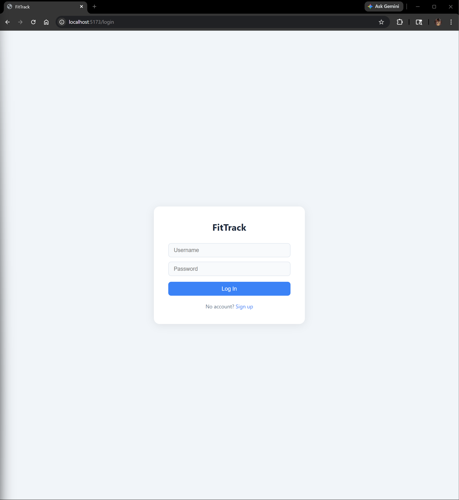
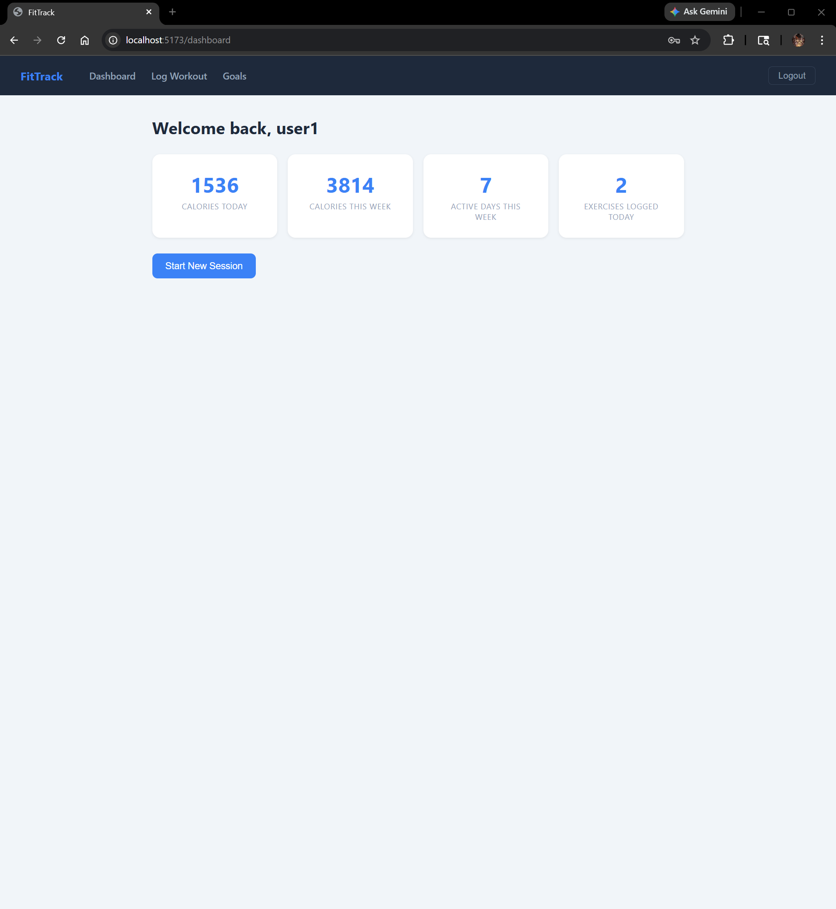
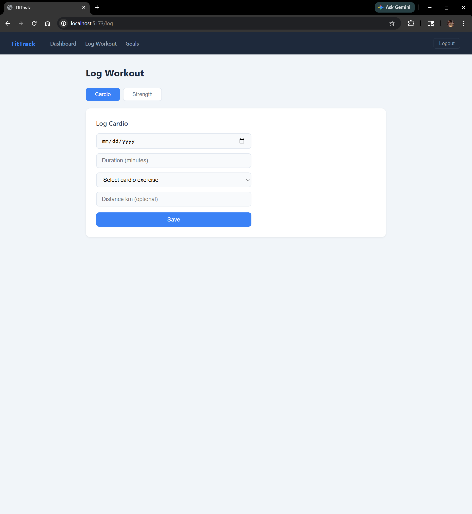
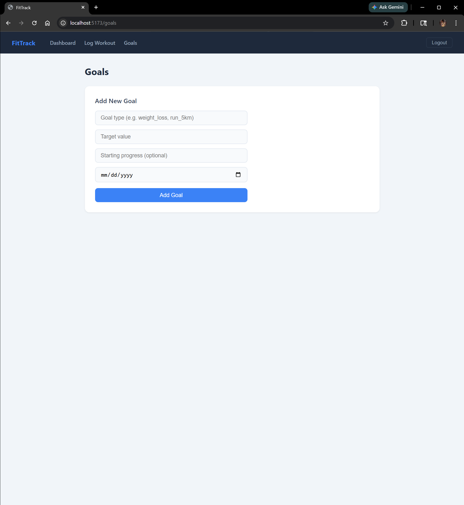
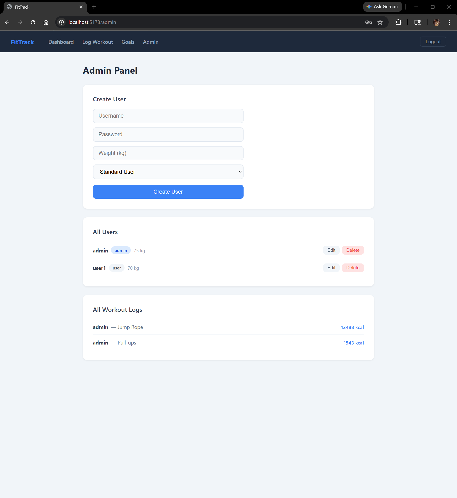
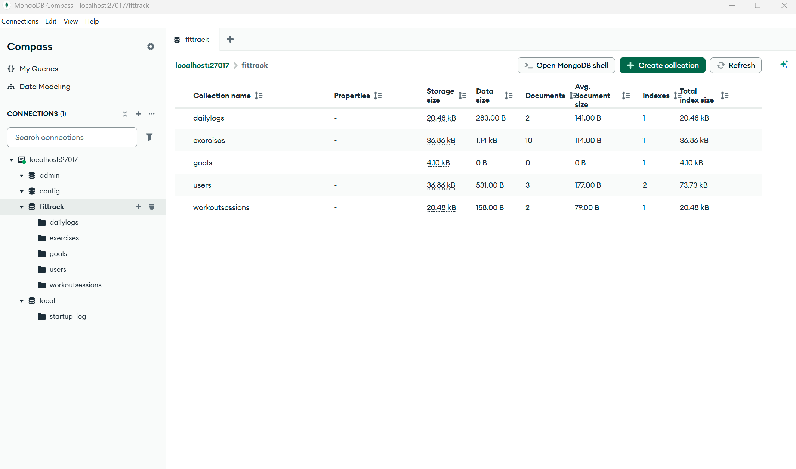

# Fitness Tracker - MERN Stack Web Application

A full-stack fitness tracking application built using the MERN stack (MongoDB, Express.js, React, Node.js). The application allows users to track workouts, manage fitness goals, and monitor exercise activity through a role-based system with secure authentication.

---

## Features

- JWT Authentication
- Role-Based Access Control
- Workout Session Tracking
- Exercise Logging
- Goal Management
- CRUD API Operations
- Protected Routes
- MongoDB Data Persistence
- Admin Dashboard Functionality

---

## Tech Stack

### Frontend
- React
- Vite
- React Router
- CSS

### Backend
- Node.js
- Express.js
- MongoDB
- Mongoose
- JWT Authentication
- bcrypt

---

## Database Design

The application uses MongoDB collections for:

- Users
- Workout Sessions
- Exercises
- Daily Logs
- Goals

The system implements relational-style data modeling using MongoDB references and structured Mongoose schemas.

---

## Application Screenshots

### Login Page


### Dashboard


### Workout Logging


### Goals Page


### Admin Panel


### MongoDB Collections


---

## My Contributions

This project was developed collaboratively as part of a university software engineering project.

My primary contributions included:

- Designing MongoDB schemas and Mongoose models
- Structuring backend collections and database relationships
- Supporting CRUD database operations
- Assisting with backend integration
- Contributing to data architecture and persistence logic

---

## Installation

### Clone Repository

```bash
git clone https://github.com/LewBrew/fitness-tracker.git
```

### Install Dependencies

Backend:
```bash
npm install
```

Frontend:
```bash
cd client
npm install
```

### Run Backend Server

```bash
node server.js
```

### Run Frontend

```bash
cd client
npm run dev
```

---

## Future Improvements

- AWS deployment
- Mobile responsive enhancements
- Improved analytics dashboard
- Expanded workout recommendation system
- Enhanced validation and testing

---

## Academic Context

Developed for CIS 4004 - Spring 2026.
